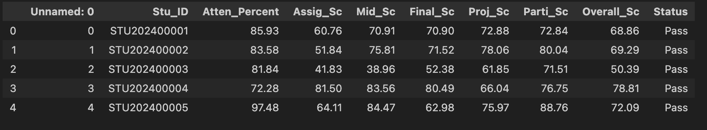
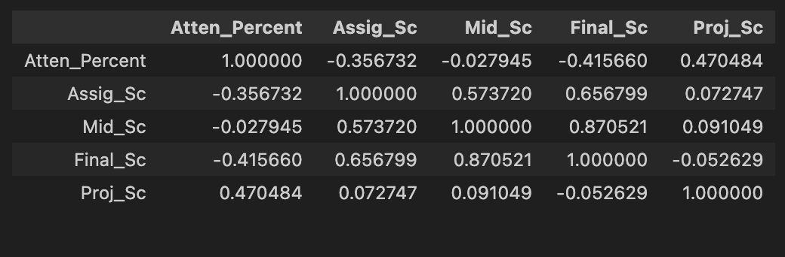
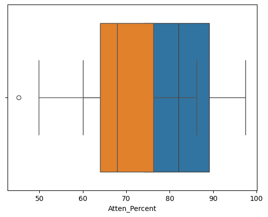
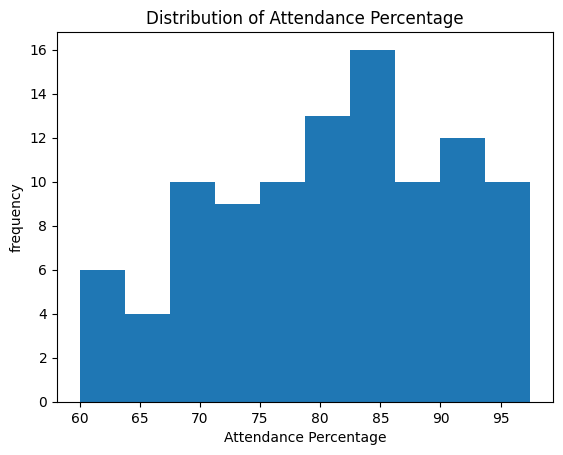
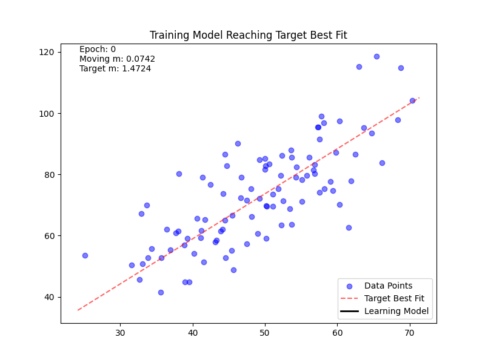
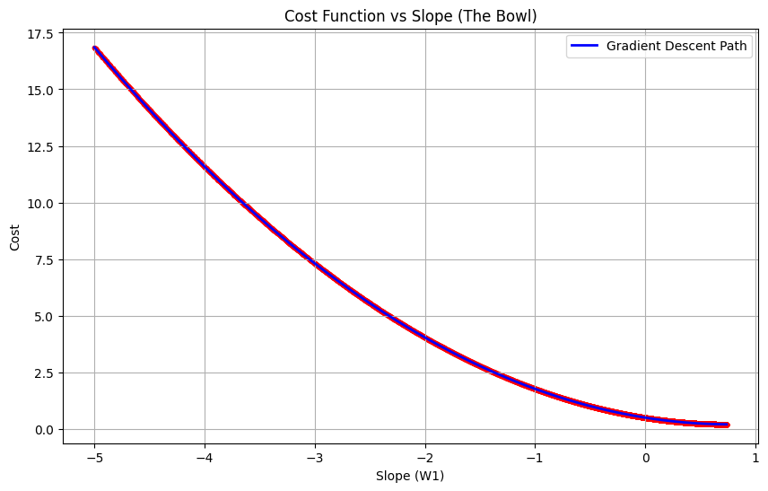
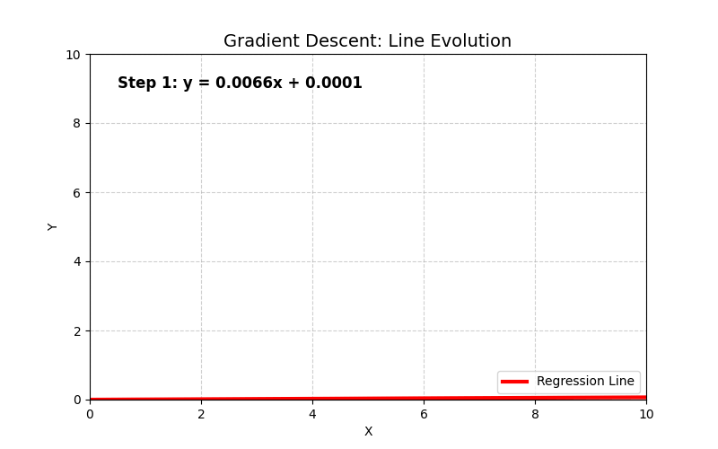

# La Study De Linear Regression - [REPORT](##)

# Scholar Matric Prediction ( Final Score of Student )

> Data Head


```py
data = pd.read_csv("C:/Users/ROG/Desktop/machine learning/Student_Performance.csv").head(100)
print("\nShape of dataset:", data.shape)
print()
data.head()
```


```py
X=data.iloc[:,2]
Y=data.iloc[:,-2]
fig, plot_data_set = plt.subplots()
plot_data_set.set_title("Single Feature DataSet")
plot_data_set.set_xlabel("Attendance Percentage")
plot_data_set.set_ylabel("Overall Score")
plot_data_set.scatter(X,Y,label="Data Points")
plt.show()
```

> Co Relationg Tabel



> HeatMap


```py
plt.figure(figsize=(8,6))
sns.heatmap(cor_data, annot=True, cmap='coolwarm')
plt.title("Feature Correlation Heatmap")                                            #cmap='coolwarm' → color scheme
plt.show()                                                                                    #Blue = negative correlation (-1)
#White = zero correlation (0)
#Red = positive correlation (+1)
```

> Outliners

```py
import seaborn as sns
import matplotlib.pyplot as plt

sns.boxplot(x=data['Atten_Percent'])      #Atten_Percent--blue
sns.boxplot(x=data['Overall_Sc'])         #Overall_Sc--orange
plt.show()
```

> Histogram



```py
plt.hist(data["Atten_Percent"], bins=10)
plt.xlabel("Attendance Percentage")
plt.ylabel("frequency")
plt.title("Distribution of Attendance Percentage")
plt.show()
```

# Training The Moodeeell

# La Simple Single Feature Regression Model




```py
## our hyopthesis function is pre_y = w0+w1X

## intialize the value 

W0 = 0 ##assume this is the best fit line interscept
W1 = -5  # assume this is the best fit line slope
alpha = 0.001 ##learing rate
tolerance = 1e-6 ##tolerence
epoch = 0 ## checking how many time loop run

slope = [] ## storing each slop 
slope.append(W1)
intercept=[] ## storing each intercept
intercept.append(W0)

previous_cost = float('inf') 
cost_history = [] ##store the costinto this to plot further graph

m = len(Y)


while True:
    pre_Y = W0+W1*X ## predict new value based on that wo and w1

    cost = (1/(2*m))*np.sum(np.square(pre_Y-Y)) ## calculating the cost at that  w0 and w1
    cost_history.append(cost) ## storing the cost into cost history
    if abs(previous_cost - cost) <=tolerance: ## breaking the loop if diff is tending to zero
      break
    
    previous_cost = cost

    epoch= epoch+1

    ##updating the w0 and w1
    error = pre_Y-Y
    W0 = W0-(alpha/m)*(np.sum(error))   
    W1 = W1-(alpha/m)*(np.sum(X*error))
    slope.append(W1)
    intercept.append(W0)

print(f"Final W0: {W0}, Final W1: {W1}")
```

```py
# loading training data
training_data_size=len(X)
# features and lables
features=pd.DataFrame({
    "intercept Coeffecient":np.ones(training_data_size),
    "feature 1":X
})
labels=Y


# print features and labels
print("Total Features",len(features))
print(features)
print("label")
print("Label : ",type(labels),"length-",len(labels))
print(labels.head())
# Model Training From Scratch - Gradient Descent
features_len=len(features.columns)
coefficient_vector=np.zeros(features_len)
coefficient_history=[]

learning_rate=0.00001

def hypothesis(
        coefficient_vector=None,
        feature_vector=None
        ):
    # print(coefficient_vector)
    # print(feature_vector)
    return np.dot(coefficient_vector,feature_vector)
    
# for i in range(training_data_size):
f_v=features.iloc[0].to_numpy()
l_v=labels.iloc[0]
# print(f_v)
# print(l_v)
# print(-1*learning_rate*(hypothesis(coefficient_vector,f_v)-l_v)*f_v[1])

# training
for i in range(training_data_size):
    # itteratin through features
    feature_v=features.iloc[i].to_numpy()
    label_v=labels.iloc[i]
    hypothesis_v=hypothesis(coefficient_vector,feature_v) # hpothesis
    # print(coefficient_vector)
    for fi in range(features_len):
        cost=((hypothesis_v-l_v)*f_v[fi])*learning_rate
        # update ith coefficient
        # print(coefficient_vector[fi]+(((hypothesis_v-l_v)*f_v[fi])*learning_rate*-1))
        coefficient_vector[fi]=coefficient_vector[fi]-(cost)
    coefficient_history.append(coefficient_vector.copy())

print(coefficient_history)

```

### Cost Function wrt to itterations



# Effects of High Learning Rate


# Effects of High Learning Rate



# Multi Feature Regression Model

> Data Set Visualisation


> Model Training Visulisation


```py
# loading training data
training_data_size=len(X)
# features and lables
features=pd.DataFrame({
    "intercept Coeffecient":np.ones(training_data_size),
    "feature 1":X,
    "Feature 2":X1
})
labels=Y


# print features and labels
print("Total Features",len(features))
print(features)
print("label")
print("Label : ",type(labels),"length-",len(labels))
print(labels.head())
# Model Training From Scratch - Gradient Descent
features_len=len(features.columns)
coefficient_vector=np.zeros(features_len)
coefficient_history=[]

learning_rate=0.00001

def hypothesis(
        coefficient_vector=None,
        feature_vector=None
        ):
    return np.dot(coefficient_vector,feature_vector)
    
# for i in range(training_data_size):
f_v=features.iloc[0].to_numpy()
l_v=labels.iloc[0]
# print(f_v)
# print(l_v)
# print(-1*learning_rate*(hypothesis(coefficient_vector,f_v)-l_v)*f_v[1])

# training
for i in range(training_data_size):
    # itteratin through features
    feature_v=features.iloc[i].to_numpy()
    label_v=labels.iloc[i]
    hypothesis_v=hypothesis(coefficient_vector,feature_v) # hpothesis
    # print(coefficient_vector)
    # t_vector=np.zeros(len(coefficient_vector))
    for fi in range(features_len):
        cost=((hypothesis_v-l_v)*f_v[fi])*learning_rate
        # update ith coefficient
        # print("---------")
        # print()
        # print(coefficient_vector[fi]+(((hypothesis_v-l_v)*f_v[fi])*learning_rate*-1))
        coefficient_vector[fi]=coefficient_vector[fi]-(cost)
        # print(coefficient_vector[fi]-learning_rate*(((hypothesis_v)-l_v)*f_v[fi]))
    coefficient_history.append(coefficient_vector.copy())

print(coefficient_history)
```