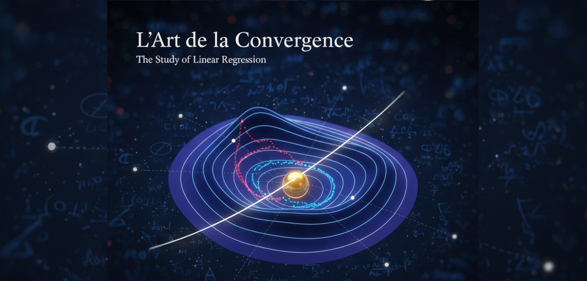
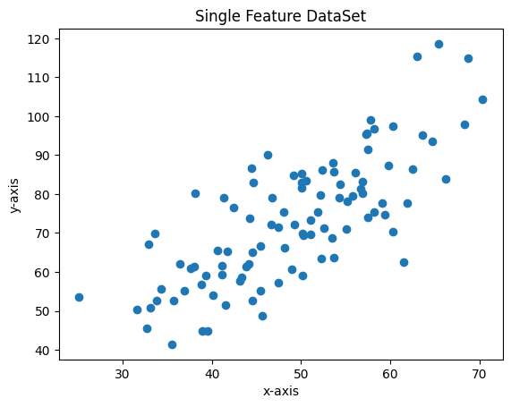
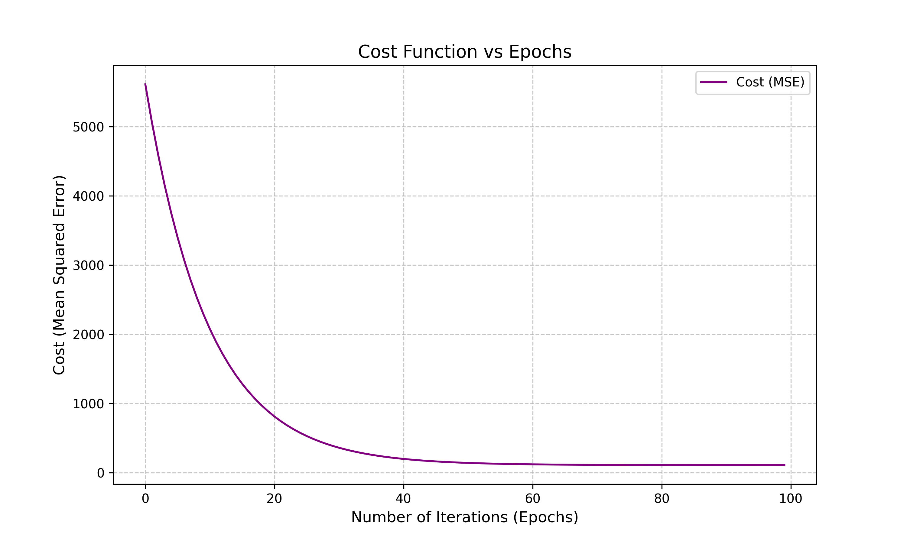

# La Study De Linear Regression - [REPORT](##)



### To implement, analyze, and compare various linear regression models including simple linear regression, multiple linear regression, polynomial regression, and regularization techniques.

# Implementing Simple Single Feature Regression Model

> Single Feature DataSet



```py
fig, plot_data_set = plt.subplots()
plot_data_set.set_title("Single Feature DataSet")
plot_data_set.set_xlabel("x-axis")
plot_data_set.set_ylabel("y-axis")
plot_data_set.scatter(X,Y,label="Data Points")

fig.savefig("../assets/single_feature_dataset.png", bbox_inches='tight')

plt.show()
```

> Training Single Feature DataSet


```py
# Building the model
m = 0
c = 0

alpha = 0.00001  # The learning Rate
epochs = 100  # The number of iterations to perform gradient descent

n = float(len(X)) # Number of elements in X

history = [] # To store (m, c) at each epoch to animate the gif

cost_history = []

# Performing Gradient Descent
for i in range(epochs):
    Y_pred = m*X + c  # The current predicted value of Y

    #calculate the cost 
    cost = (1/n)*sum((Y-Y_pred)**2)
    cost_history.append(cost)

    D_m = (-2/n) * sum(X * (Y - Y_pred))  # Derivative wrt m
    D_c = (-2/n) * sum(Y - Y_pred)  # Derivative wrt c

    m = m - alpha * D_m  # Update m
    c = c - alpha * D_c  # Update c

    # Store the current state
    history.append((m, c))

final_m, final_c = m, c
print(f"Final Weights: m={m}, c={c}")
```

# Cost Function WRT to Itterations



# Student DataSet : Single Feature Model
